# Esp32使用MQTT协议连接OneNet

## 开发环境：

硬件：ESP32-WROOM-32E-N4R2

软件：[MQTTX](https://mqttx.app/zh)，[OneNET-token](https://open.iot.10086.cn/doc/aiot/develop/detail/242)，Vscode，esp-idf，

协议：MQTT(V3.1.1)

## OneNET创建设备

### 步骤顺序：

1. 进入OneNET官网点击控制台

2. 点击设备管理服务

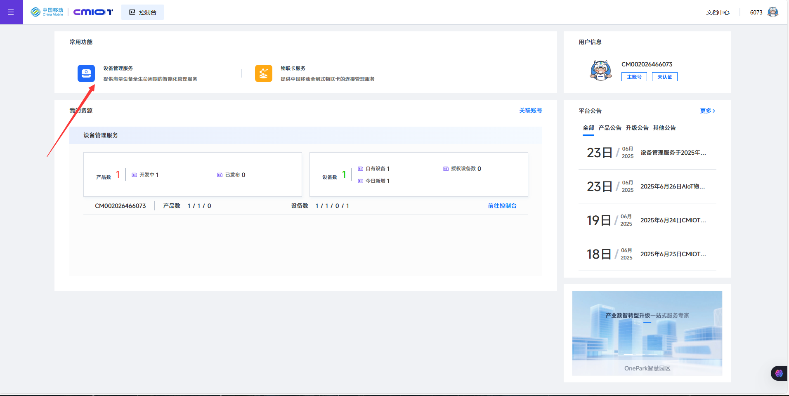

3. 在左侧菜单栏点击产品开发

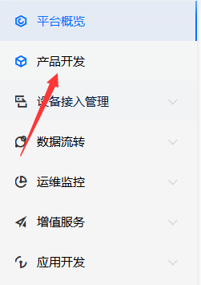

4. 点击创建产品

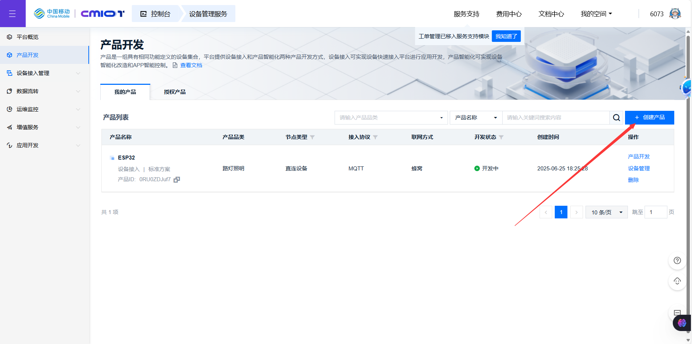

5. 配置如下，品类随意，名称随意，地址随意，其余配置如图

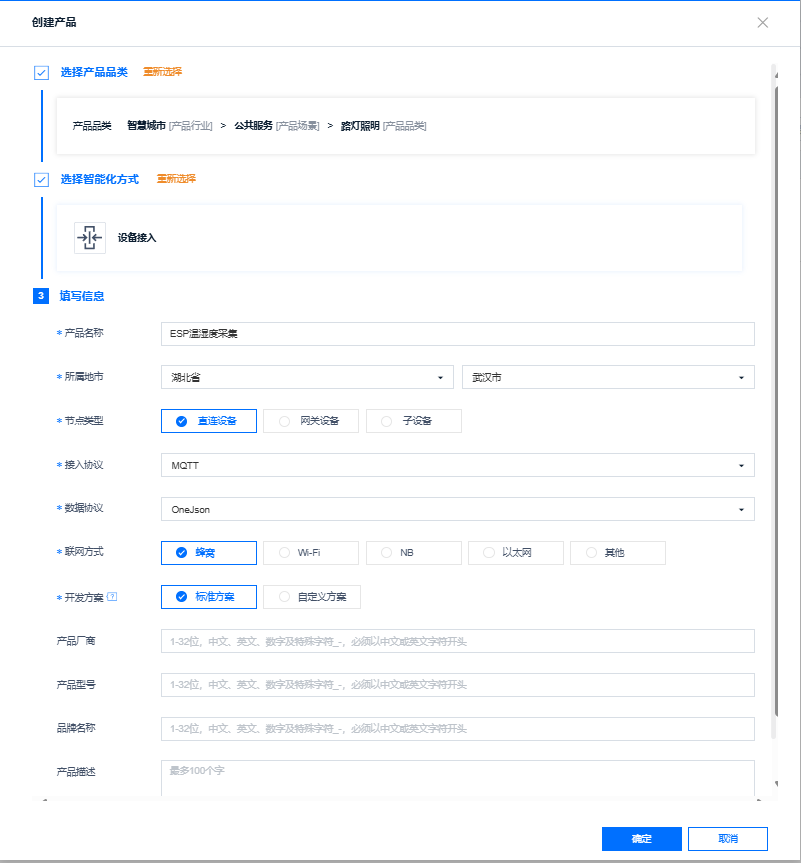

6. 创建成功后点击设备管理

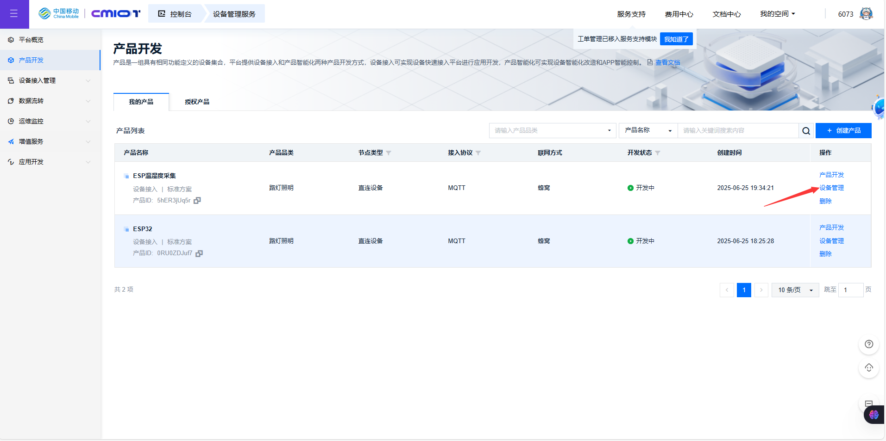

7. 点击添加设备

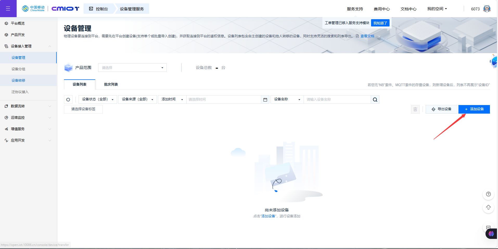

8. 配置如下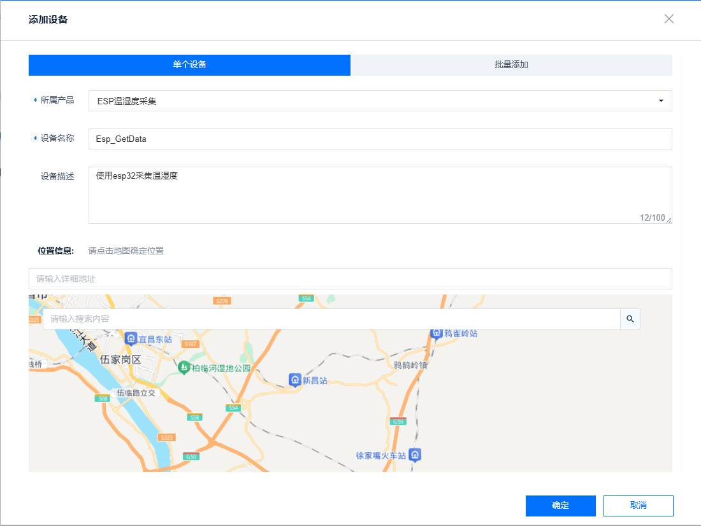

9. 创建成功后点击详情

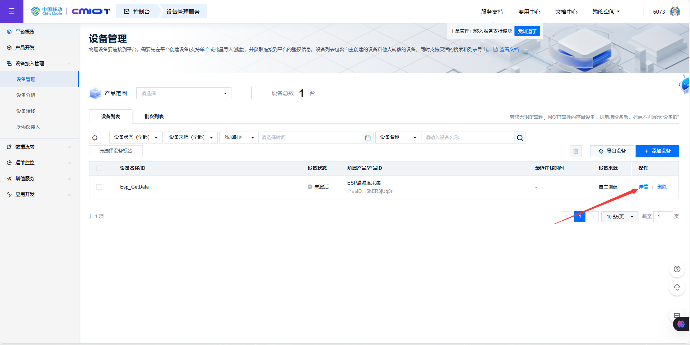

10. 查看当前设备信息重点关注圈住部分，至此云端创建设备成功

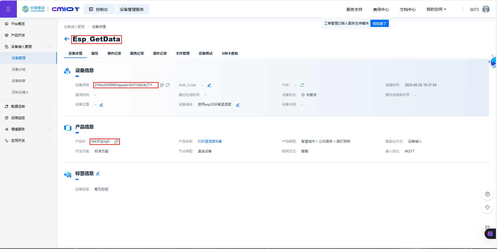

## 使用MQTTX测试连接

### 步骤顺序：

1. 打开MQTTX软件点击新建（中文在设置里）

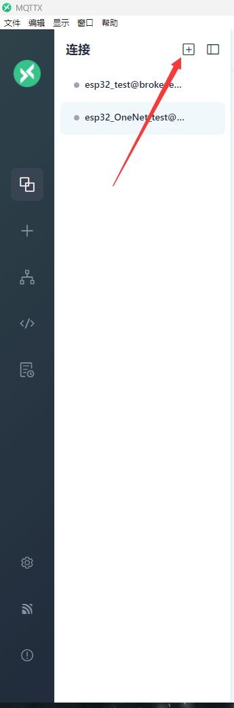

2. 配置如下，其中名称随意，服务器地址如图所示（[官方参考](https://open.iot.10086.cn/doc/aiot/develop/detail/248)），ClientID，用户名与OneNET创建设备步骤10中所框选的保持对应，密码需要使用工具OneNET-token生成

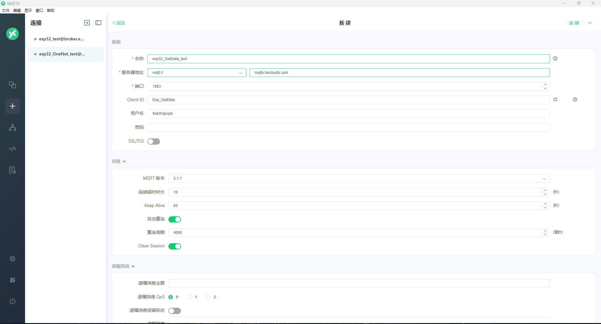

3. 打开OneNET-token、

   1. res：products/5hER3jUq5r/devices/Esp_GetData

      其中**5hER3jUq5r**：为自己的产品ID

      Esp_GetData：为自己的产品名称

      其余不变

   2. et：表示token的访问有效期（即过期时间）
   
      ~~~
      /*token过期时间,请按照实际具体需求计算token过期时间,本例中为从1970-1-1到2035-12-31的秒数*/
      int64_t expire_time = 2082643200;
      ~~~
   3. key:为步骤10的产品密钥
   4. 点击Generate生成密钥复制在MQTTX中

4. 返回MQTTX中，添加key，点击连接

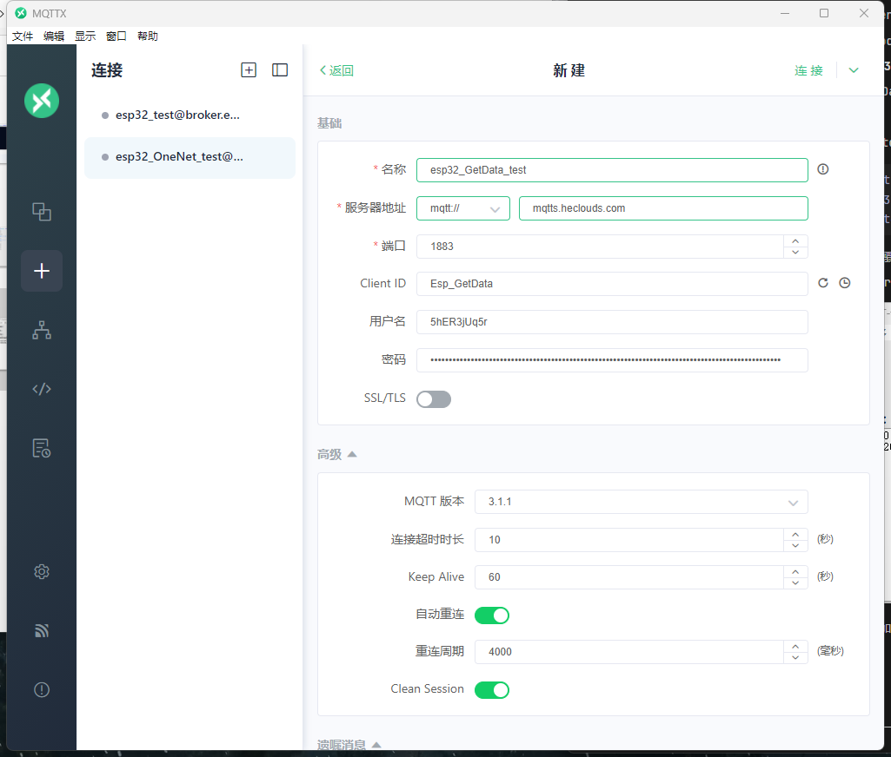

5. 显示连接成功

   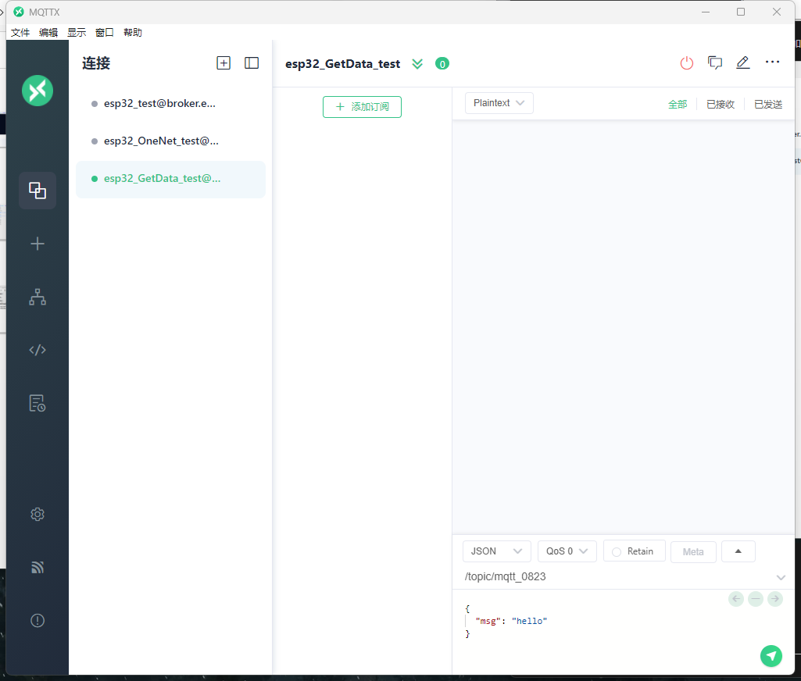

6.打开云端查看设备，显示设备在线

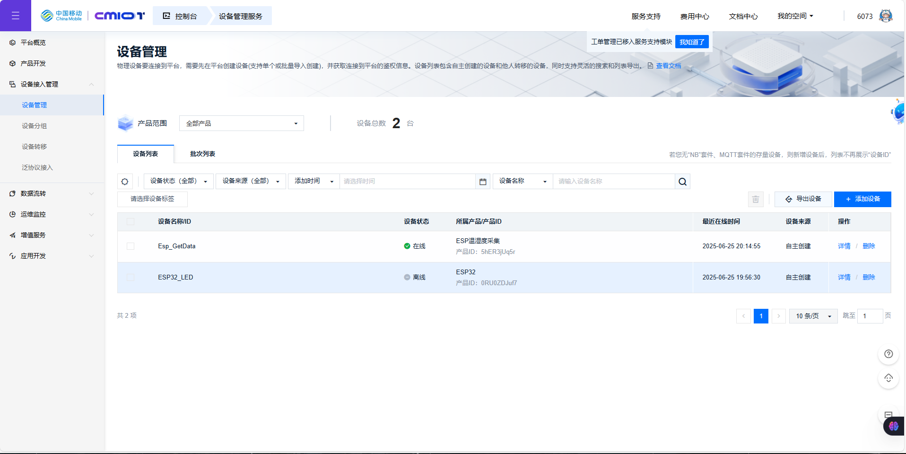
